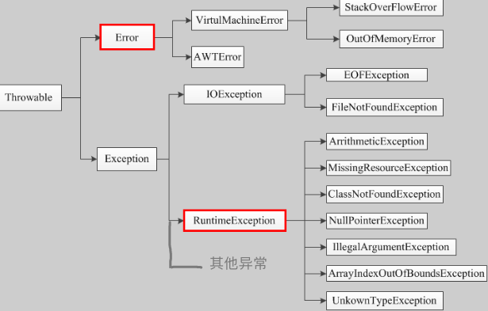
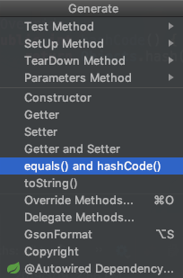
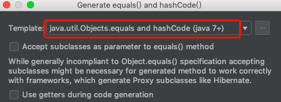
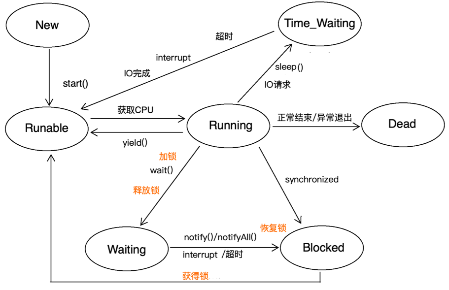
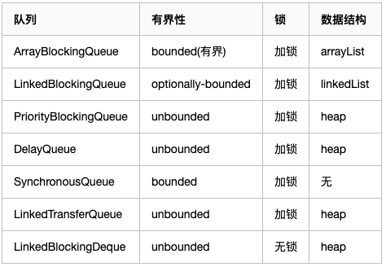
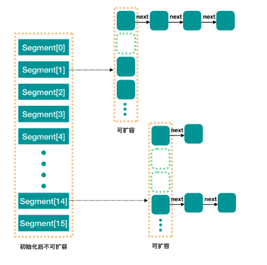
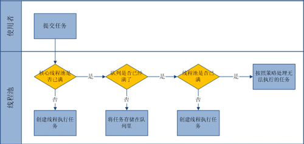
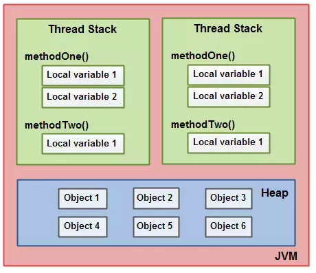

# java基础

## 重写

+ 参数列表必须完全相同

+ 返回值类型是被重写方法的返回值类型，或其子类

  ```java
  public class OverrideTest extends Test{
      @Override
      Long test1(Long id) {
          return id;
      }
  }
  
  class Test{
      Object test1(Long id){
          return 0L;
      }
  }
  ```

+ 重写方法的访问权限不能低于被重写方法的访问权限

  被重写方法的访问权限为protected，重写方法必须为protected或public

  权限由高到低：public、protected、未指定、private

+ 父类的方法可以被子类或孙子类等重写，不是只有子类可以重写

+ final、private、static、构造方法永远不能被重写

  未指定访问权限的方法能否被重写取决于父子类是否在同一个包中，同一包中可以重写，否则不能重写

+ 重写方法可以抛出任意非强制性异常，但是只能抛出小于等于被重写方法的强制性异常

## 重载

+ 必须修改参数列表
+ 可以修改返回值类型、访问修饰符、强制性异常
+ 可以在子类中重载

## 异常

### Throwable

  

+ Error

  即使被异常处理器捕获了，也无法进行有效处理，保证程序正产运行的问题，被定义为错误

  程序中不必对错误进行处理，因为程序处理不了

+ RuntineException

  运行时异常，一般是代码写的不好导致的，这类异常可以通过修改代码完全杜绝的，不应该通过异常处理器解决

+ 其他异常（包括IOException）

  这类异常是无法通过代码完全杜绝的，但是可以通过异常处理器进行有效处理，保证程序正常运行

  这类异常必须通过异常处理器处理

### 异常分类

+ 非检查异常/非强制性异常

  + 非检查异常的意思是，不应该通过异常处理器解决的异常；这类异常也叫非强制性异常，因为这类异常不是必须通过异常处理器处理的
  + 这类异常包括：Error、RuntimeException

+ 检查异常/强制性异常

  除`Error`和`RuntimeException`之外的异常都是检查异常，也叫强制性异常，这类异常必须通过异常处理器处理

### 何时导致程序停止

所有的异常，如果抛到`jvm`层面了，程序就会停止

## equals和hashcode

### equals

+ 为什么重写`equals`方法

  每个类默认的`equals`方法是继承`Object`的`equals`方法

  ```java
  public boolean equals(Object obj) {
    return (this == obj);
  }
  ```

  该方法只能判断对象的引用是否相等，也就是这两个对象是否为同一个对象

  实际应用中的需求是，如果两个对象的类型及属性完全相同，即使不是同1个对象，也认为这两个对象相等，此时就需要重写`equals`方法

+ 如何重写

  在`IDEA`中，在类内部使用`ctrl+enter`，按下图自动生成`equals`和`hashcode`方法

     

  ```java
  @Override
  public boolean equals(Object o) {
    if (this == o) return true;
    if (o == null || getClass() != o.getClass()) return false;
    A a = (A) o;
    return Objects.equals(name, a.name) &&
      Objects.equals(age, a.age);
  }
  
  @Override
  public int hashCode() {
    return Objects.hash(name, age);
  }
  ```

### hashcode

+ 介绍

  `hashcode`方法作用是根据对象属性值生成哈希值，该哈希值用于决定在哈希集合中的存储位置

  重写`equals`方法的同时必须重写`hashcode`方法

+ 为什么

  重写`equals`方法，则认为我们的需求是：如果两个对象类型相同，属性相等，则认为这两个对象相等

  在使用哈希集合存储数据时，如`hashSet`，集合会使用对象的`hashcode`找到他的存储位置

  如果我们只重写了`equals`方法，没有重写`hashcode`方法，则会出现如下情况

  ```java
  Set<A> aSet = new HashSet<>();
  A a1 = new A("a",1);
  A a2 = new A("a",1);
  aSet.add(a1);
  aSet.add(a2);		// 虽然 a1.equals(a2) ，因为根据Object类中hashcode方法生成的哈希值不等，
  								// 所以不会认为是相同的数据，仍然可以放进去
  ```

+ 如何重写

  参见[equals](#equals) 

## instanceof与getClass

+ instanceof

  + java关键字

  + 语法

    ```java
    if (!(o instanceof A)) return false;
    ```

  + 功能：判断对象`o`是否为class`A`的1个实例

  + 说明：如果`o`为`O`的实例，`A`为`O`的父类，则`o instanceof A`结果也为`true`

+ getClass

  + `Object`类的方法
  + 用户获取对象的类的信息

+ 说明

  ```java
  class A{
    void test(Object o){
      System.out.println(getClass() == o.getClass());
      System.out.println(o instanceof A);
      // 上面结果为true，则下面结果一定为true
      // 下面结果为true，则上面结果不一定为true，因为o也可能为A的子类的实例
    }
  }
  ```

  

# java高级编程

> 参考资料
>
> + [菜鸟教程](http://www.runoob.com/java/java-data-structures.html) 

## 多线程

> 参考资料：
>
> + [Java中的多线程你只要看这一篇就够了](https://www.cnblogs.com/wxd0108/p/5479442.html)
> + [Java总结篇系列：Java多线程（一）](https://www.cnblogs.com/lwbqqyumidi/p/3804883.html) 

### 概念

+ 多线程

  指的是这个程序（一个进程）运行时产生了不止一个线程

+ 并行与并发

  + 并行

    **多个cpu**实例或者**多台机器**同时执行一段处理逻辑，是真正的同时

    一个进程的多个线程可以被多个CPU内核并行执行

  + 并发

    通过cpu调度算法，让用户看上去同时执行，实际上从cpu操作层面不是真正的同时。

    并发往往在场景中有公用的资源，那么针对这个公用的资源往往产生瓶颈，我们会用TPS或者QPS来反应这个系统的处理能力。

+ 线程安全

  ​	线程安全经常用来描绘一段代码。指在并发的情况之下，该代码经过多线程使用，线程的调度顺序不影响任何结果。反过来，线程不安全就意味着线程的调度顺序会影响最终结果，如不加事务的转账代码：

  ```java
  void transferMoney(User from, User to, float amount){
    to.setMoney(to.getBalance() + amount);
    from.setMoney(from.getBalance() - amount);
  }
  ```

  > 如果两个线程同时调用这段代码，如同时执行到`to.setMoney(to.getBalance() + amount);`这句，线程1执行`getBalance()`之后，执行`setMoney()`之前，线程2执行了`getBalance()`，则线程1、2执行的`getBalance()`会得到相同的结果，然后线程1、2分别加上`amount`后执行`setMoney()`，则最终的结果就是只有1个线程中的`amount`被加上了，而应该得到的结果是线程1、2的`amount`都加上

+ 同步

  Java中的同步指的是通过人为的控制和调度，保证共享资源的多线程访问成为线程安全，来保证结果的准确。如上面的代码简单加入`synchronized`关键字

  ```java
  void transferMoney(User from, User to, float amount){
      synchronized (to) {
          to.setMoney(to.getMoney() + amount);
      }
      synchronized (from) {
          from.setMoney(from.getMoney() - amount);
      }
  }
  ```

### 同步锁

#### 锁类型

+ 可重入锁

  + 线程获取到1个锁之后，释放锁之前，再次申请获取同一个锁，线程会忽略内部的锁，直接执行内部锁保护的内容，这样的锁叫可重入锁

  + 非可重入锁会造成死锁

  + 示例

    ```java
    public class ReentrantLockTest {
        synchronized void method1(){
            method2();          // 调用 method2 时，因为 this对象已经被当前线程锁住，
                                // 所以不会再次获取该锁，直接执行method2
        }
        synchronized void method2(){
        }
    }
    ```

+ 可中断锁

  等待获取锁的过程可以被打断的锁

+ 公平锁

  等待时间越长，获取锁的优先级越高的锁

+ 读写锁

  读写文件时，读与写的操作互斥，写于写互斥，但是读与读之间不互斥得锁

#### synchronized

>  参见[Java中synchronized的用法](http://www.importnew.com/21866.html) 

+ 功能

  当执行到关键字`synchronized`时，会先判断`()`内的对象是否已经被其他锁锁住；

  如果被锁住了，则等待该对象解锁

  如果/等到对象处于未被锁定的状态，则锁定该对象，执行`{}`内的代码，执行结束后释放锁

+ 使用方法

  `synchronized`有多种使用方法

  + 作用于代码块

    语法：synchronized( this ) { }

    ()内的**对象**被其他锁锁住时，不执行{}内的代码，等待解锁

  + 作用于方法

    语法：synchronized void method(){}

    相当于方法内的所有代码外加上synchronized( this ) { }

  + 作用于静态方法

    语法：synchronized static void method(){}

    也相当于方法内的所有代码外加上synchronized( this ) { }

    但是不同对象的静态方法的this引用是相同的，所以不同对象调用这个静态方法时是互斥的

  + 作用于类

    语法：synchronized( A.class ) { }

    该类的所有对象都使用同一把锁

#### lock()

> 参考资料：
>
> + [详解synchronized与Lock的区别与使用](https://blog.csdn.net/u012403290/article/details/64910926) 
> + [Lock和synchronized的区别和使用](https://www.cnblogs.com/baizhanshi/p/6419268.html) 

+ `synchronized`的缺陷

  - A线程获取到锁了，B线程等待A释放锁，如果A一直不释放，则B会一直等下去，影响执行效率
  - 读写文件时，读与写的操作应该互斥，写于写应该互斥，但是读与读之间没必要互斥，但是使用`synchronized`读与读操作也是互斥的，影响效率

  - `synchronized`无法获取到锁的状态，无法根据锁的状态决定执行哪些操作

  `lock()`锁解决了这些缺陷

+ 使用方法

  + Lock接口

    ```java
    package java.util.concurrent.locks;
    public interface Lock {
        // 等待获取锁
        void lock();
        // 等待获取锁，等待状态可以被interrupt
        void lockInterruptibly() throws InterruptedException;
        // 尝试获取锁，返回是否获取成功
        boolean tryLock();
        // 在指定时间内尝试获取锁，指定时间内，一旦获取到锁立即返回true，超时没有获取到锁，则返回false，
        boolean tryLock(long time, TimeUnit unit) throws InterruptedException;
        // 释放锁
        void unlock();
        Condition newCondition();
    }
    ```

  + 使用示例

    ```java
    class LockThread implements Runnable {
        public static User1 from = new User1();
        // 注意 Lock 对象的定义方式及位置，同一个lock对象之间的锁是互斥的，否则互不影响
        private Lock lock = new ReentrantLock();
    
        @Override
        public void run() {
            for (int i = 0; i < 50; i++) {
                transferMoney(from,5.0f);
            }
        }
    
        private void transferMoney(User1 from, float amount){
            lock.lock();
            try {
                from.setMoney(from.getMoney() + amount);
            } catch (Exception e) {
                e.printStackTrace();
            } finally {
                lock.unlock();
            }
        }
    }
    ```

  + 注意

    + 注意 Lock 对象的定义方式及位置，同一个lock对象之间的锁是互斥的，否则互不影响
    + `unlock()`必须放在`finally`中执行，否则会造成死锁

+ 读写锁

  + `ReadWriteLock`接口

    ```java
    public interface ReadWriteLock {
    	// 获取读锁
        Lock readLock();
    	// 获取写锁
        Lock writeLock();
    }
    ```

  + `ReentrantReadWriteLock`实现类

    `ReadWriterLock`接口的实现类，使用实例如下：

    ```java
    class ReadThread implements Runnable{
        // 这里必须使用 ReadWriteLock 接收，不能再使用 Lock
        ReadWriteLock lock = new ReentrantReadWriteLock();
    
        @Override
        public void run() {
            for(int i=0; i<5; i++){
                read();
            }
        }
    
        public void read(){
            lock.readLock().lock();
            try{
                // 执行读
            }finally {
                lock.readLock().unlock();
            }
        }
    }
    ```

+ 公平锁

  `ReentrantReadWriteLock`和`ReentrantLock`默认都是非公平锁，但是可以通过构造方法指定是否使用公平锁，例：

  ```java
  Lock lock = new ReentrantLock();						// 非公平锁
  Lock lock = new ReentrantLock(false);					// 非公平锁
  Lock lock = new ReentrantLock(true);					// 公平锁
  ReadWriteLock lock = new ReentrantReadWriteLock();		// 非公平锁
  ReadWriteLock lock = new ReentrantReadWriteLock(false);	// 非公平锁
  ReadWriteLock lock = new ReentrantReadWriteLock(true);	// 公平锁
  ```

#### synchronized、locked()区别

|  类别  |                         synchronized                         |                    lock                     |
| :----: | :----------------------------------------------------------: | :-----------------------------------------: |
|  类型  |                            关键字                            |                     类                      |
| 释放锁 | 执行完同步代码自动释放锁<br />同步代码发生异常，jvm让线程释放锁 | 在finally中必须释放锁，不然容易造成线程死锁 |
| 获取锁 |                         只有1种方式                          |              多种获取锁的方式               |
| 锁状态 |                     无法判断锁是否被占用                     |                  可以判断                   |
| 锁类型 |               可重入、不可中断、非公平、非读写               |     可重入、可中断、可以公平、可以读写      |
|  性能  |                             较低                             |                    较高                     |

### 线程生命周期

     

线程的生命周期中包含5种状态：

+ **新建状态（New）：**当线程对象对创建后，即进入了新建状态，如：Thread t = new MyThread();

+ **就绪状态（Runnable）：**当调用线程对象的start()方法（t.start();），线程即进入就绪状态。处于就绪状态的线程，只是说明此线程已经做好了准备，随时等待CPU调度执行，并不是说执行了t.start()此线程立即就会执行；

+ **运行状态（Running）：**当CPU开始调度处于就绪状态的线程时，此时线程才得以真正执行，即进入到运行状态。注：就     绪状态是进入到运行状态的唯一入口，也就是说，线程要想进入运行状态执行，首先必须处于就绪状态中；

+ **阻塞状态（Blocked）：**处于运行状态中的线程由于某种原因，暂时放弃对CPU的使用权，停止执行，此时进入阻塞状态，直到其进入到就绪状态，才 有机会再次被CPU调用以进入到运行状态。根据阻塞产生的原因不同，阻塞状态又可以分为三种：

  + 同步阻塞（Blocked）：

    线程获取同步锁（synchronized）失败，则进入阻塞态，等待锁被释放后重新进入就绪态

    >  之所以叫做同步阻塞态，估计是该线程一边阻塞着，一边定期尝试获取同步锁

  + 异步阻塞（Time_Waiting）:

    线程中执行了sleep、请求IO时，线程就会进入异步阻塞状态，等到满足超时、interrupt、IO完成等条件时，就会被异步唤醒，进入就绪态

  + 等待阻塞（Waiting）：

    + 该状态本身与`Time_Waiting`状态没什么区别，只不过因为wait()必须放在同步代码块中执行（为什么参见[wait、notify、notifyAll必须位于synchronized代码块](#wait、notify、notifyAll必须位于synchronized代码块)），wait()在进入阻塞态时释放了锁，被唤醒后需要恢复锁，所以需要再经历一次`Blocked`状态，才把wait()经历的阻塞态单独表示出来的

    + 上图中`Running → Waiting → Blocked → Runable `的过程参见如下代码

      ```java
      						// Running状态
      synchronized (obj){	// 加锁
          obj.wait();				// 进入 Waiting 状态，并释放锁
          					// 被唤醒后，尝试恢复锁，没恢复之前处于 Blocked 状态
          					// 获得锁后，进入Runable状态
      }
      ```

+ **死亡状态（Dead）：**线程执行完了或者因异常退出了run()方法，该线程结束生命周期。

### 同步、异步、阻塞、非阻塞

> 参见[一文读懂并发与并行，同步阻塞与异步阻塞](https://cloud.tencent.com/developer/news/257034) 

+ 同步

  主动去查询是否满足条件

+ 异步

  被通知是否满足条件

+ 阻塞

  没满足条件之前什么都不做，就等着，直到满足条件继续执行

+ 非阻塞

  没满足条件之前先去做别的，满足条件再回来继续执行

+ 同步阻塞

  当前线程无法继续执行，需要暂停时，进入阻塞态，不去执行其他任务，不断的查询是否满足继续运行的条件，直到满足条件继续执行

+ 同步非阻塞

  当前线程无法继续执行，需要暂停时，先去执行其他任务，并且定期查询是否满足继续运行的条件，直到满足条件回来继续执行当前线程

+ 异步阻塞

  当前线程无法继续执行，需要暂停时，进入阻塞态，不去执行其他任务，等待被通知满足继续执行的条件后继续执行当前线程

+ 异步非阻塞

  当前线程无法继续执行，需要暂停时，先去执行其他任务，等到被通知满足继续执行的条件后回来继续执行当前线程

### 常用方法

#### 方法介绍

##### Thread类

+ start

  + 语法

    ```java
    public synchronized void start()
    ```

  + 功能：使线程进入`Runable`状态

+ sleep

  + 语法

    ```java
    public static native void sleep(long millis);
    public static void sleep(long millis, int nanos);
    ```

  + 功能：使当前线程进入阻塞态，直到超时或被interrupt唤醒

  + 说明：
    + sleep方法不能被notify()唤醒
    + 进入阻塞态时不会释放同步锁

+ join

  + 语法

    ```java
    public final void join();
    public final synchronized void join(long millis);
    public final synchronized void join(long millis, int nanos);
    ```

  + 功能：使当前线程进入阻塞态，直到被notify、超时、调用者线程结束、interrupt唤醒

  + 例

    ```java
    t.join();	// 当前线程进入阻塞态，直到线程t结束
    ```

  + 说明

    + join的实现方法是，在当前线程执行wait()，直到调用者线程结束调用notify()唤醒当前线程，所以join()能被notify唤醒，进入阻塞态时也会释放同步锁

+ yield

  + 语法

    ```java
    public static native void yield();
    ```

  + 功能：使当前线程重新进入`Runable`状态

+ interrupt

  + 语法

    ```java
    public void interrupt()
    ```

  + 功能：

    如果调用方线程处于异步阻塞态，则立即唤醒该线程，并设置该线程的中断信号

    如果调用方线程处于运行态，则设置该线程的中断信号

  + 说明

    线程被设置中断信号后，不会有任何影响，只有在`run`方法中对中断信号进行处理后这个中断才有作用

##### Object类

+ wait

  + 语法

    ```java
    void wait();
    void wait(long timeout);
    void wait(long timeout, int nanos);
    ```

  + 功能：使当前线程进入阻塞态，直到被nofity、interrupt、超时唤醒

  + demo

    ```java
    // 调用wait的代码
    synchronized (obj){
        obj.wait();
    }
    // 调用notify的代码
    synchronized (obj){
        obj.notify();		// 这里的obj需要与上面的obj是同1个对象才会被唤醒
    }
    ```

  + 说明：

    + 进入`Waiting`阻塞态同时释放同步锁，唤醒后需要恢复同步锁
    + 必须位于同步代码块中，原因参见[wait、notify、notifyAll必须位于synchronized代码块](#wait、notify、notifyAll必须位于synchronized代码块) 
    + 调用`wait`的对象必须是被`synchronized`锁住的对象

+ notify

  + 语法

    ```java
    void notify();
    ```

  + 功能：随机唤醒1个锁住调用者对象的，处于`Waiting`阻塞态的线程

  + 说明：

    + 必须用于同步代码块，原因参见[wait、notify、notifyAll必须位于synchronized代码块](#wait、notify、notifyAll必须位于synchronized代码块) 
    + 调用`notify`的对象必须是被`synchronized`锁住的对象

+ notifyAll

  - 语法

    ```java
    void notifyAll();
    ```

  - 功能：唤醒所有锁住调用者对象的，处于`Waiting`阻塞态的线程

  - 说明：

    - 必须用于同步代码块，原因参见[wait、notify、notifyAll必须位于synchronized代码块](#wait、notify、notifyAll必须位于synchronized代码块) 
    - 调用`notifyAll`的对象必须是被`synchronized`锁住的对象

##### Condition

+ 介绍

  `synchronized`配合`Object`类的`wait`、`notify`实现线程同步

  `lock`配合`Condition`类的`await`、`signal`实现线程间同步

+ 方法

  + await()是当前线程等待同时释放锁
  + awaitUninterruptibly()不会在等待过程中响应中断
  + signal()用于唤醒一个在等待的线程，还有对应的singalAll()方法

+ 例

  ```java
  class Test1 implements Runnable {
      Lock lock = new ReentrantLock();
      Condition condition = lock.newCondition();
  
      @Override
      public void run() {
          // lock
          lock.lock();
          try {
              for (int i = 0; i < 10000; i++) {
                  System.out.println(Thread.currentThread().getName() + " : " + i);
                  // 如果没有这里的await 和 signal，两线程分别打印10000次
                  // 加上这两句话，交替打印10000次
                  condition.signal();
                  condition.await();
              }
              condition.signal();
          } catch (InterruptedException e) {
              e.printStackTrace();
          } finally {
              // unlock
              lock.unlock();
          }
      }
  }
  ```

#### sleep与wait区别

> 参见[Java线程阻塞方法sleep()和wait()精炼详解](https://blog.csdn.net/weixin_41101173/article/details/79889464) 

|   类型   |    sleep     |            wait            |
| :------: | :----------: | :------------------------: |
|    类    |    Thread    |           Object           |
| 时间参数 | 必须设置时间 | 可以设置时间，也可以不设置 |
|  释放锁  |   不释放锁   |           释放锁           |
|   使用   |   任意地方   |       仅限同步代码块       |

#### wait、notify、notifyAll必须位于synchronized代码块

monitor：Java中的每个对象都有一个监视器，来监测并发代码的重入。在非多线程编码时该监视器不发挥作用，反之如果在synchronized 范围内，监视器发挥作用。

wait/notify必须存在于synchronized块中。并且，这三个关键字针对的是同一个监视器（某对象的监视器）。这意味着wait之后，其他线程可以进入同步块执行。

当某代码并不持有监视器的使用权时去wait或notify，会抛出java.lang.IllegalMonitorStateException。也包括在synchronized块中去调用另一个对象的wait/notify，因为不同对象的监视器不同，同样会抛出此异常。

### 线程间通信

+ 线程间通信方式

  > 参见[JMM和底层实现原理](https://www.jianshu.com/p/8a58d8335270) 

  + 共享内存

    线程之间通过写-读内存中的公共状态来隐式进行通信

    如：synchronized中锁的状态、volatile中变量的状态

  + 消息传递

    线程之间通过明确的发送消息来显式进行通信

    如：wait/notify

+ 上述通信方式是大分类，具体有哪些实现方法参见[JAVA线程间通信的几种方式](https://blog.csdn.net/u011514810/article/details/77131296) 

### volatile

> 参见[谈谈Java中的volatile](https://www.cnblogs.com/chengxiao/p/6528109.html) 

#### 介绍

+ 当1个对象被声名为volatile时，每次加载该对象中的属性，都会重新去堆中load，每次改变时，都会直接save回堆中，并使其他线程中该变量的缓存失效

+ 禁止指令重排

  + 指令重排

    `a=1;b=2`这样的操作编译器编译时会进行指令重排，因为这两句之间没有依赖关系，可能会颠倒其执行顺序

    但是有时这种指令重排会导致程序出现问题，如

    ```java
    public class TestVolatile {
        int a = 1;
        boolean status = false;
    
        public void changeStatus(){
            a = 2;//1
            status = true;//2	// 如果重排后这句话先执行，可能会导致执行结果为2
        }
    
        public void run(){
            if(status){//3
                int b = a+1;//4
                System.out.println(b);
            }
        }
    }
    ```

  + volatile禁止指令重排规则

    + 当第二个操作是voaltile写时，无论第一个操作是什么，都不能进行重排序
    + 当地一个操作是volatile读时，不管第二个操作是什么，都不能进行重排序
    + 当第一个操作是volatile写时，第二个操作是volatile读时，不能进行重排序

#### 缺陷

+ 问题

  多线程环境下`volatile`变量`num`执行`num++`，`num++`不是原子操作，可以分为读、加、写3步，当1个线程执行加时，另外线程执行写，则会导致前者的执行失效

+ 解决方案

  保证volatile变量操作的原子性，通过[循环CAS方式](#原子类)实现

  ```java
  public class Counter {
  　　//使用原子操作类
      public static AtomicInteger num = new AtomicInteger(0);
      //使用CountDownLatch来等待计算线程执行完
      static CountDownLatch countDownLatch = new CountDownLatch(30);
      public static void main(String []args) throws InterruptedException {
          //开启30个线程进行累加操作
          for(int i=0;i<30;i++){
              new Thread(){
                  public void run(){
                      for(int j=0;j<10000;j++){
                          num.incrementAndGet();//原子性的num++,通过循环CAS方式
                      }
                      countDownLatch.countDown();
                  }
              }.start();
          }
          //等待计算线程执行完
          countDownLatch.await();
          System.out.println(num);
      }
  }
  ```

#### volatile与synchronized区别

> 参见[volatile和synchronized的区别](https://www.cnblogs.com/kaleidoscope/p/9506018.html) 

- volatile本质是在告诉jvm当前变量在寄存器（工作内存）中的值是不确定的，需要从主存中读取； synchronized则是锁定当前变量，只有当前线程可以访问该变量，其他线程被阻塞住。
- volatile仅能使用在变量级别；synchronized则可以使用在变量、方法、和类级别的
- volatile仅能实现变量的修改可见性，不能保证原子性；而synchronized则可以保证变量的修改可见性和原子性
- volatile不会造成线程的阻塞；synchronized可能会造成线程的阻塞。
- volatile标记的变量不会被编译器优化；synchronized标记的变量可以被编译器优化

### 基本线程类

#### Thread

+ 继承`Thread`类，重写`run`方法

  ```java
  public class RealizationThread {
      public static void main(String[] args) {
          Thread1 thread1 = new Thread1();
          thread1.start();
      }
  }
  
  class Thread1 extends Thread{
      @Override
      public void run() {
          System.out.println("thread1");
      }
  }
  ```

+ 内部类方式，重写`run`方法

  ```java
  new Thread(){
      @Override
      public void run() {
          System.out.println("thread2");
      }
  }.start();
  ```

#### Runable

+ 实现`Runable`接口

  ```java
  public class RealizationThread {
      public static void main(String[] args) {
          Thread thread3 = new Thread(new Thread3());
          thread3.start();
      }
  }
  class Thread3 implements Runnable{
      @Override
      public void run() {
          System.out.println("thread3");
      }
  }
  ```

+ 内部类实现`Runable`接口

  ```java
  new Thread(new Runnable() {
      @Override
      public void run() {
          System.out.println("thread4");
      }
  }).start();
  ```

#### Callable

+ 优点

  + 可以抛出异常
  + 可以获得线程返回值

+ 实现方式

  创建类实现`Callable`接口，重写`call`方法

  创建`FutureTask`对象，构造方法传入`Callable`接口实现类对象

  创建`Thread`对象，构造方法传入`FutureTask`对象

  ```java
  FutureTask<Integer> task = new FutureTask<>(new Callable<Integer>() {
      @Override
      public Integer call() throws Exception {
          System.out.println("thread5");
          return 1;
      }
  });
  Thread thread5 = new Thread(task);
  thread5.start();
  // 判断线程是否执行结束，非阻塞
  System.out.println(task.isDone());
  try {
      // 等待线程执行结束并获取返回值，阻塞
      System.out.println(task.get());
  } catch (InterruptedException e) {
      e.printStackTrace();
  } catch (ExecutionException e) {
      e.printStackTrace();
  }
  System.out.println(task.isDone());
  ```

### 高级多线程控制类

#### ThreadLocal

##### 功能

+ 对1个共享变量使用`ThreadLocal`后，该变量与线程进行绑定，每个线程中该变量都是相互独立的

+ 例

  ```java
  public class RealizationThread {
      public static void main(String[] args) {
          Thread6 thread6 = new Thread6();
          Thread thread61 = new Thread(thread6);
          Thread thread62 = new Thread(thread6);
          thread61.start();
          thread62.start();
      }
  }
  class Thread6 implements Runnable{
      // 将1个Integer类型的局部变量与线程绑定，初始值为0
      ThreadLocal<Integer> local = ThreadLocal.withInitial(() -> 0);
      @Override
      public void run() {
          local.set(local.get() + 1);		// 修改1个线程中的该变量并不影响另外一个线程中该变量的值
          System.out.println("thread3 local = " + local.get());
      }
  }
  ```

##### 原理

> 自己查看`ThreadLocal.get()`源码

每个`Thread`对象中都有1个`ThreadLocalMap`对象，用来保存于当前线程绑定的所有属性

当指定执行`ThreadLocal`对象的`get()`方法时，就会去当前线程对象中查看`ThreadLocalMap`变量，找到对应的对象了就返回，否则为当前线程创建1个该对象的副本

如：在1个线程类中创建2个`ThreadLocal`对象，则使用该类创建的每个线程中的结构如下图

 

#### 原子类

+ 在`java.util.concurrent.atomic`包下有很多原子类，如`AtomicInteger`、`AtomicBoolean`等

+ 原子类用于保证对变量操作的原子性

  如`Integer`类型的`num`执行`num++`就不具备原子性，在多线程条件下可能会出现新值被写会`num`之前其他线程修改了`num`的值，导致结果出错

  原子类可以保证类似`num++`这样的操作过程中不会有其他线程进来参与，导致结果出错

+ 原理

  + CAS

    CAS(compareAndSwap)是在cpu层面上的硬件同步策略，会在硬件层面上产生阻塞

#### 容器类

##### BlockingQueue

+ 阻塞队列

+ 实现类

   

  有锁的即为线程安全的

##### ConcurrentHashMap

> 参见[Java7/8 中的 HashMap 和 ConcurrentHashMap 全解析](http://www.importnew.com/28263.html) 

+ java7

  + 结构

     

    `ConcurrentHashMap`中有固定数量的`segment`（默认16，初始化时可以指定，指定后不可扩容），每个`segment`下挂着1个哈希表，哈希表的数组长度可以动态扩容

  + 线程安全

    `Segment`是继承`ReentrantLock`的，所以每个`segment`拥有独立的锁，`segment`数组的大小就是`ConcurrentHashMap`支持的并发数

    `put`和`remove`操作均使用`segment`独占锁，但是`get`操作没有使用独占锁

  + 构造方法

    ```java
    public ConcurrentHashMap(int initialCapacity,float loadFactor, int concurrencyLevel)
    ```

    + loadFactor：负载因子，该参数是针对每个`segment`设定的

      在每个`segment`中，当已用容量与总容量的比大于等于该值时进行扩容；默认0.75

      每个`segment`扩容后容量为原来2倍

    + concurrencyLevel：指定的`segment`的个数，默认16

      最终采用值为如下方法计算结果

      ```java
      // concurrencyLevel 默认16
      // MAX_SEGMENTS = 2^16
      if (concurrencyLevel > MAX_SEGMENTS)
          concurrencyLevel = MAX_SEGMENTS;
      // Find power-of-two sizes best matching arguments
      int sshift = 0;
      int ssize = 1;
      while (ssize < concurrencyLevel) {
          ++sshift;
          ssize <<= 1;
      }
      // ssize为最终segment数组大小
      ```

    + initialCapacity：整个`ConcurrentHashMap`的容量，默认16，会根据该值计算出每个`segment`的容量，计算过程如下

      ```java
      // initialCapacity 默认16
      // MAXIMUM_CAPACITY = 2^30
      if (initialCapacity > MAXIMUM_CAPACITY)
          initialCapacity = MAXIMUM_CAPACITY;
      int c = initialCapacity / ssize;
      if (c * ssize < initialCapacity)
          ++c;
      // MIN_SEGMENT_TABLE_CAPACITY = 2
      int cap = MIN_SEGMENT_TABLE_CAPACITY;
      while (cap < c)
          cap <<= 1;
      // cap为最终每个segment的容量
      ```

    + 初始化时只初始化了第1个`segment`，其他的都为`null`

+ java8

  + 结构

    java8中的`ConcurrentHashMap`的结构与java8中的`HashMap`结构一致

  + 线程安全

    使用`synchronized`与CAS实现线程安全

  + 方法

    + 构造函数

      构造函数汇总没有做任何事情，仅根据指定参数计算出1个值`sizeCtl`，用于控制`table`（就是哈希桶）的初始化、扩容操作

    + put

      put操作中进行了如下动作：初始化`table`、扩容、数据迁移、转换红黑树

#### 线程池

##### 原理

> 参考资料：
>
> +  [JAVA线程池原理详解一](https://www.cnblogs.com/dongguacai/p/6030187.html)
> + [线程池创建](https://blog.csdn.net/congge_1993/article/details/73497439) 

+ ThreadPoolExecutor及其属性

  `ThreadPoolExecutor`是线程池的核心类，他有几个核心的属性

  ```java
  public ThreadPoolExecutor(int corePoolSize,
                            int maximumPoolSize,
                            long keepAliveTime,
                            TimeUnit unit,
                            BlockingQueue<Runnable> workQueue,
                            ThreadFactory threadFactory,
                            RejectedExecutionHandler handler)
  ```

  + corePoolSize：线程池核心线程数量

  + maximumPoolSize：线程池最大线程数量

  + keepAliverTime：当活跃线程数大于核心线程数时，空闲的多余线程最大存活时间

  + unit：存活时间的单位

    如：`TimeUnit.MILLISECONDS`

  + workQueue：存放任务的队列

    参见[BlockingQueue](#BlockingQueue)，一般使用`LinkedBlockingQueue`

  + threadFactory：用于创建线程的工厂类

    一般使用`new ThreadFactoryBuilder().setNameFormat("thread-test-%d").build();`

  + handler：饱和策略，超出线程范围和队列容量的任务的处理程序

    `RejectedExecutionHandler`接口有4个实现类

    + AbortPolicy：直接抛出异常

    + CallerRunsPolicy：只用调用所在的线程运行任务

      哪个线程要往线程池中放该任务，就由哪个线程执行

    + DiscardOldestPolicy：丢弃队列里最近的一个任务，并执行当前任务。

    + DiscardPolicy：不处理，丢弃掉。

+ 提交任务处理流程

   

  + 判断**线程池里的核心线程**是否都在执行任务，如果不是（核心线程空闲或者还有核心线程没有被创建）则创建一个新的工作线程来执行任务。如果核心线程都在执行任务，则进入下个流程。

  + 线程池判断工作队列是否已满，如果工作队列没有满，则将新提交的任务存储在这个工作队列里。如果工作队列满了，则进入下个流程。

  + 判断**线程池里的线程**是否都处于工作状态，如果没有，则创建一个新的工作线程来执行任务。如果已经满了，则交给饱和策略来处理这个任务。

+ 创建方式

  + 使用`com.google.guava`包

    ```java
    ThreadFactory namedThreadFactory = new ThreadFactoryBuilder().setNameFormat("thread-test-%d").build();
    ExecutorService executorService = new ThreadPoolExecutor(5,10,0L,TimeUnit.MILLISECONDS, new LinkedBlockingQueue<>(10),namedThreadFactory);
    ```

  + 使用`commons-lang3`包

    ```java
    ScheduledExecutorService executorService2 = new ScheduledThreadPoolExecutor(1,
                    new BasicThreadFactory.Builder().namingPattern("thread-test-%d").daemon(true).build());
    ```

    `daemon`：是否创建守护线程

+ 守护线程

  参见[Java线程和守护进程](https://www.cnblogs.com/kxdblog/p/4315155.html) 

##### springboot中使用线程池

> 参考资料：
>
> + [SpringBoot线程池的创建、@Async配置步骤及注意事项](https://blog.csdn.net/Muscleheng/article/details/81409672) 
> + [SpringBoot线程池配置和使用](https://blog.csdn.net/no_can_no_bb_/article/details/83112939) 
> + [Spring中@Async用法总结](https://www.cnblogs.com/lcngu/p/6185363.html) 

+ 配置

  + application.properties

    ```properties
    # 配置核心线程空闲 keep-alive 时间后是否被回收，默认true
    spring.task.execution.pool.allow-core-thread-timeout=true
    # 默认8
    spring.task.execution.pool.core-size=8
    # 默认60s
    spring.task.execution.pool.keep-alive=60s
    # 默认 Intager.MAX_VALUE
    spring.task.execution.pool.max-size=16
    # 阻塞队列大小,默认 Intager.MAX_VALUE
    spring.task.execution.pool.queue-capacity=16
    # 线程池中线程名称前缀，默认：task-
    spring.task.execution.thread-name-prefix=task-
    ```

  + 配置类

    ```java
    @Configuration
    public class ExecutorConfig {
    
        @Value("${spring.task.execution.pool.allow-core-thread-timeout}")
        private Boolean allowCoreThreadTimeout;
        @Value("${spring.task.execution.pool.core-size}")
        private int corePoolSize;
        @Value("${spring.task.execution.pool.keep-alive}")
        private Duration keepAlive;
        @Value("${spring.task.execution.pool.max-size}")
        private int maxPoolSize;
        @Value("${spring.task.execution.pool.queue-capacity}")
        private int queueCapacity;
        @Value("${spring.task.execution.thread-name-prefix}")
        private String namePrefix;
    
        @Bean
        public Executor asyncServiceExecutor(){
            ThreadPoolTaskExecutor taskExecutor = new ThreadPoolTaskExecutor();
            taskExecutor.setAllowCoreThreadTimeOut(allowCoreThreadTimeout);
            taskExecutor.setCorePoolSize(corePoolSize);
            taskExecutor.setMaxPoolSize(maxPoolSize);
            taskExecutor.setQueueCapacity(queueCapacity);
            taskExecutor.setThreadNamePrefix(namePrefix);
            taskExecutor.setKeepAliveSeconds((int) keepAlive.getSeconds());
            taskExecutor.setRejectedExecutionHandler(new ThreadPoolExecutor.CallerRunsPolicy());
            //执行初始化
            taskExecutor.initialize();
            return taskExecutor;
        }
    }
    ```

+ 启用异步支持

  在启动类或配置类上标注`@EnableAsync`，打开异步支持

+ 使用

  + `@Async`

    + 范围：类上、方法上
    + 功能：将该注解标注的类内的所有方法，或其直接标注的方法定义为异步方法
    + 属性
      + value：要使用的线程池的`Bean`的名称，用于指定使用哪个线程池

  + 例

    异步方法定义

    ```java
    @Component
    // @Async("asyncServiceExecutor")
    public class AsyncTest {
    	// 无返回值异步方法
        @Async("asyncServiceExecutor")
        public void test1() throws InterruptedException {
            for(int i=0; i<100; i++){
                System.out.println(Thread.currentThread().getName() + " : i = " + i);
                sleep(100);
            }
        }
    	// 有返回值异步方法
        @Async("asyncServiceExecutor")
        public Future<String> test2() throws InterruptedException {
            for(int i=0; i<10; i++){
                System.out.println(Thread.currentThread().getName() + " : i = " + i);
                sleep(100);
            }
            return new AsyncResult<>("test2");
        }
    }
    ```

    异步方法调用

    ```java
    @Autowired
    private AsyncTest asyncTest;
    // 测试无返回值异步方法调用
    @Test
    public void contextLoads() throws InterruptedException {
        asyncTest.test1();
        System.out.println("主线程睡觉");
        sleep(5000);
    }
    // 测试有返回值异步方法调用
    @Test
    public void test2() throws InterruptedException, ExecutionException {
        Future<String> future = asyncTest.test2();
        while (!future.isDone());	// 等待异步方法执行完成
        System.out.println("future result = " + future.get());	// 获取返回值
    }
    ```

+ 注意事项

  + 事务

    标注`@Async`注解的异步方法上不能使用`@Transactional`注解来控制事务

    应该在`@Async`方法内**调用**标注`@Transactional`的方法

  + 异步方法必须是public方法

  + 异步方法必须是非static方法

  + 方法调用的实例必须由spring创建和管理
  
  + 不能在同一个类中调用异步方法，解决方案：
  
    + @EnableAsync(mode=AdviceMode.ASPECTJ)，并引入`spring-aspects`依赖
  
      >  测试未成功
  
    + 使用内部类，将异步方法放在内部类中
  
  + 使用`@Async`异步支持时，如果不指定线程池，使用默认线程池，线程很多时，容易造成内存溢出

### 面试题

+ 多线程交替打印

  参见[面试必问！Java 多线程中两个线程交替执行，一个输出偶数，一个输出奇数](https://www.cnblogs.com/stateis0/p/9091254.html) 

  我的实现

  ```java
  public class SwapPrint {
      static volatile Integer num = 0;
      static volatile Boolean flag = false;
  
      public static void main(String[] args) throws InterruptedException {
          Thread thread1 = new Thread(() -> {
              while (num < 10000){
                  if(!flag ){
                      num ++;
                      System.out.println(Thread.currentThread().getName() + " : " + num);
                      flag = true;
                  }
              }
          });
          Thread thread2 = new Thread(() -> {
              while (num < 10000){
                  if(flag ){
                      num ++;
                      System.out.println(Thread.currentThread().getName() + " : " + num);
                      flag = false;
                  }
              }
          });
          thread1.start();
          thread2.start();
          thread1.join();
          thread2.join();
      }
  }
  ```

## JMM

> 参见[JMM和底层实现原理](https://www.jianshu.com/p/8a58d8335270) 

+ 内存模式

   

  + 每个线程都有自己的栈，但是所有线程共享1个堆；栈用来存放线程的局部原始类型变量，堆用来存放非局部变量或对象

  + 1个线程可以传递1个自己栈的副本给其他线程，但是无法共享自己的栈

  + 缓存

    堆中的非局部变量、对象中的原始类型变量(包括引用)被线程使用时，都会被缓存到各自的栈中，在自己的栈中进行操作，然后再写回堆中

+ 引发问题

  + 可见性问题

    A线程读取了堆中数据并进行了更改，但是因为改变的是缓存中数据，还没有写回堆之前，如果B线程也来读取这个数据，则读取到的是修改之前的值

    可以通过`volatile`或`加锁`解决

  + 竞争现象

    A、B线程同时读取缓存中变量，分别+1，然后写回，则最终结果只加了1

    可以使用锁解决

  + 还有其他问题，这里不再赘述，参见资料

## 集合

### 概念

+ 加载因子

  当数据量达到总容量的多少时进行扩容

### 获得线程安全集合

使用`Collections.synchronizedxxx()`方法获得，如：

```java
Map<String,Object> map = Collections.synchronizedMap(new HashMap<>());
```

### hashMap

+ JDK1.7及以前版本，hashMap的实现方式为：哈希表

+ JDK1.8及以后版本，hashMap的实现方式为：数组 + 单向链表 + 红黑树

  链表长度大于8时，转换为红黑树

+ hashMap允许null值

+ hashMap初始容量为16，加载因子为0.75

+ 线程不安全

+ 无序集合

### LinkedHashMap

> 参考：[Java集合之LinkedHashMap](https://www.cnblogs.com/xiaoxi/p/6170590.html) 

+ 特点

  + key和value都允许为空
  + key重复会被覆盖，value可以重复
  + 有序集合
  + 非线程安全

+ `accessOrder`属性

  在`LinkedHashMap`的构造方法中可以通过该属性指定排序方式

  + true：按最少使用排序

    因为该属性，`LinkedHashMap`天然支持LRU算法

  + false：按插入顺序排序(默认)

### hashTable

+ 实现方式为：哈希表
+ 线程安全的集合
+ 不允许null值
+ 初始容量为11，加载因子为0.75
+ 无序集合

### hashSet

+ hashSet是基于hashMap实现的

  ```java
  public HashSet() {
    map = new HashMap<>();
  }
  ```

  使用存储对象的`hashcode`在`hashMap`中寻找桶的位置

+ 无序集合

+ 使用`hashSet`一般需要重写对象的`equals`和`hashcode`方法

+ 操作`hashSet`中数据时，先判断`hashCode`是否相等，相等继续使用`equals`方法判断对象是够相等，然后操作数据

+ 不要修改`hashSet`中数据

  `hashSet`中数据改变后，不会重新计算新的`hashcode`并更改存储位置

  ```java
  Set<A> aSet = new HashSet<>();
  A a1 = new A("a",1);
  A a2 = new A("a",1);
  A a3 = new A("a",2);
  A a4 = new A("a",2);
  // 使用age等于1时计算的hashcode存储在hashSet中
  aSet.add(a1);
  a1.setAge(2);
  System.out.println(a1.equals(a3));
  // 虽然 a1.equals(a3)，但是存储a1时使用的是age=1时的hashcode，
  // 而存储a3时使用的是age=2时的hashcode，所以hashcode值不同，会导致a3作为新对象存储
  aSet.add(a3);
  // a2的hashcode与存储a1时使用的hashcode相同，但是 a1.equals(a2)=false，所以a2作为新对象存储
  aSet.add(a2);
  // a4与a3hashcode值相同，并且 a1.equals(a2)=true，所以认为集合中已经存在该对象，不会存储a4
  aSet.add(a4);
  for (A anASet : aSet) {
    System.out.println(anASet);
  }
  /** 打印结果
   * true
   * A{name='a', age=2}
   * A{name='a', age=1}
   * A{name='a', age=2}
   */
  ```

### ConcurrentHashMap

参见[ConcurrentHashMap](#ConcurrentHashMap) 


# JVM


