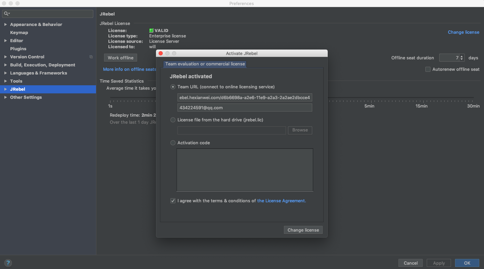
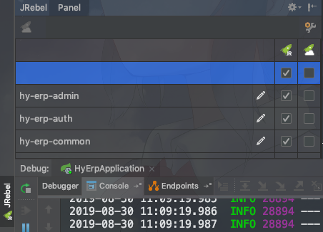

# jrebel

## 介绍

热部署插件，但是不支持`mapper.xml`文件热部署

## 安装激活

+ 在idea中安装插件`jrebel for intellij`

+ 重启后在如下界面激活

  url：`https://jrebel.hexianwei.com/d6b6698a-a2e6-11e9-a2a3-2a2ae2dbcce4`

  邮箱随便填

   

## 使用

+ 项目中配置

   

+ 使用

  + 加载当前文件：`build --> recompile`
  + 加载所有已修改文件：`run --> reload changed classes`

# jr-mybatisplus

+ 使用`jrebel`无法实现`mapper.xml`热部署，加上`jr-mybatisplus`可以实现
+ 前提：
  + 使用了`jredel`
  + mybatisplus版本最低`3.1.0`
+ 教程参见：https://github.com/SweetInk/jrebel-mybatisplus